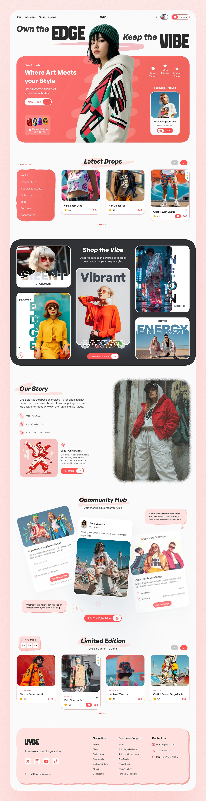

# Vybe

A modern community-driven web app built with Next.js (App Router) and TypeScript. Vybe focuses on connecting users
through curated content, events, and a vibrant community hub.



## Features

- Next.js App Router with server and client components
- Responsive UI with reusable components (Hero, Navbar, CommunityHub, etc.)
- TypeScript-first codebase
- PostCSS/Tailwind-ready pipeline (see `postcss.config.mjs`)
- Optimized assets under `public/`

## Tech Stack

- Next.js 14+
- React 18
- TypeScript
- PostCSS

## Getting Started

Prerequisites:

- Node.js 18+
- pnpm (recommended) or npm/yarn/bun

Install dependencies:

```bash
pnpm install
# or
npm install
```

Start the development server:

```bash
pnpm dev
# or
npm run dev
yarn dev
bun dev
```

Open http://localhost:3000 in your browser.

## Project Structure

```
.
├─ app/                 # App Router pages and layout
├─ components/          # Shared React components
├─ public/              # Static assets (served at /)
│  └─ imgs/
│     ├─ maq_1.png
│     └─ maq_2.png
├─ styles/              # Global styles
├─ data/                # Local data sources
└─ package.json         # Scripts and deps
```

Key entry points:

- `app/layout.tsx` – root layout
- `app/page.tsx` – home page
- `components/` – UI building blocks

## Scripts

```bash
pnpm dev       # Start dev server
pnpm build     # Build for production
pnpm start     # Start production server
pnpm lint      # Lint codebase
```

## Assets and Images

- App images live in `public/imgs/` so they are available at runtime under `/imgs/*`.
- This README embeds the mockups directly from the repository paths:
    - `./public/imgs/maq_1.png`
    - `./public/imgs/maq_2.png`

## Deployment

You can deploy on any platform that supports Node.js. For Vercel:

1. Push this repo to GitHub/GitLab/Bitbucket
2. Import the project in Vercel
3. Use the default Next.js build settings

## Contributing

Pull requests are welcome. For major changes, please open an issue to discuss what you would like to change.

## License

This project is proprietary unless a license file is provided. If you intend to open source it, add a license (e.g.,
MIT) at the project root.
